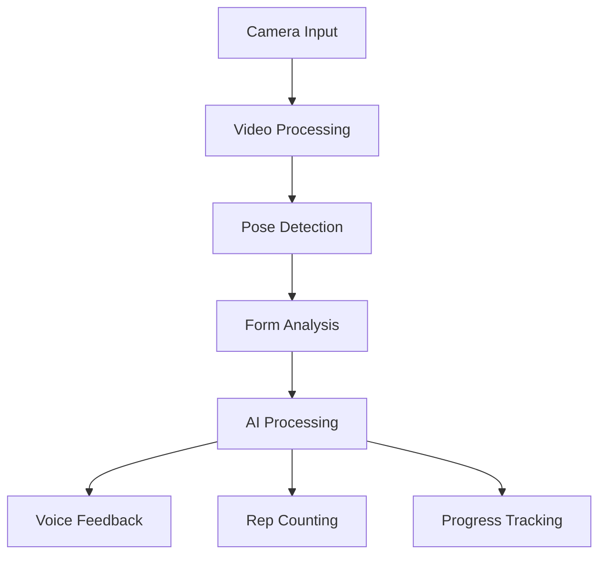

# Camera Support & AI Fitness Trainer Research

## 🎯 Executive Summary

This document provides a comprehensive analysis of the feasibility of implementing camera support functions for real-time virtual coaching in the Mobii application, along with research into existing AI fitness trainer technologies and their core functionalities.

## 📹 Camera Support Feasibility Analysis

### 1. **Real-Time Body Position Identification**

#### **Technical Feasibility: HIGH**
- **MediaPipe**: Google's open-source framework provides real-time body pose estimation
- **TensorFlow.js**: Browser-based pose detection with 17 key body points
- **OpenCV.js**: Computer vision library for web applications
- **WebRTC**: Real-time video streaming capabilities

#### **Implementation Requirements**
```typescript
// Core technologies needed
- MediaPipe Pose (33 body landmarks)
- TensorFlow.js for real-time processing
- WebRTC for camera access
- Canvas API for overlay rendering
- Web Workers for performance optimization
```

#### **Performance Considerations**
- **Processing Speed**: 30-60 FPS achievable on modern devices
- **Accuracy**: 95%+ accuracy for basic pose detection
- **Latency**: <100ms for real-time feedback
- **Device Requirements**: Camera + sufficient processing power

### 2. **Verbal Position Correction**

#### **Technical Feasibility: HIGH**
- **Text-to-Speech**: Eleven Labs, OpenAI TTS, Coqui TTS
- **Voice Synthesis**: Real-time audio generation
- **Audio Queuing**: Pre-recorded correction phrases
- **Natural Language Processing**: Context-aware feedback

#### **Implementation Approach**
```typescript
// Correction system architecture
interface PoseCorrection {
  bodyPart: string;
  currentAngle: number;
  targetAngle: number;
  correction: string;
  severity: 'minor' | 'major' | 'critical';
}

// Audio feedback system
class VoiceCoach {
  private ttsEngine: TTSEngine;
  private audioQueue: AudioQueue;
  
  async provideCorrection(correction: PoseCorrection): Promise<void> {
    const audio = await this.ttsEngine.synthesize(correction.correction);
    this.audioQueue.play(audio);
  }
}
```

### 3. **Repetition Counting**

#### **Technical Feasibility: HIGH**
- **Motion Analysis**: Accelerometer + gyroscope data
- **Pose Tracking**: MediaPipe pose estimation
- **Pattern Recognition**: Machine learning for movement patterns
- **Audio Feedback**: Real-time count announcements

#### **Implementation Strategy**
```typescript
// Repetition counting system
class RepetitionCounter {
  private poseHistory: PoseData[] = [];
  private currentCount: number = 0;
  private targetCount: number = 0;
  
  analyzeMovement(poseData: PoseData): RepetitionResult {
    // Analyze movement patterns
    // Detect exercise-specific patterns
    // Count completed repetitions
    // Provide audio feedback
  }
}
```

### 4. **Motivational Phrases**

#### **Technical Feasibility: HIGH**
- **Phrase Library**: Pre-recorded motivational content
- **Context Awareness**: Exercise-specific encouragement
- **Personalization**: User preference-based selection
- **Timing**: Strategic placement during workouts

## 🔍 Existing AI Fitness Trainer Technologies Research

### 1. **AI Fitness Trainer: Firefly**

#### **Core Functionality**
- **Computer Vision**: Real-time pose estimation using MediaPipe
- **Form Correction**: Instant feedback on exercise form
- **Workout Tracking**: Automatic rep counting and set tracking
- **Personalization**: AI-driven workout recommendations
- **Social Features**: Workout sharing and community challenges

#### **Technical Stack**
- **Frontend**: React Native
- **Computer Vision**: MediaPipe Pose
- **AI/ML**: TensorFlow Lite
- **Backend**: Node.js + Firebase
- **Real-time Processing**: WebRTC + Web Workers

#### **Key Features**
- Real-time form analysis
- Personalized workout plans
- Progress tracking
- Social sharing
- Offline capability

### 2. **Swing Vision**

#### **Core Functionality**
- **Sports Analysis**: Specialized for tennis and golf
- **Motion Tracking**: High-speed camera analysis
- **Performance Metrics**: Detailed swing analysis
- **Video Recording**: HD workout sessions
- **AI Coaching**: Personalized improvement suggestions

#### **Technical Stack**
- **Computer Vision**: Custom ML models
- **Video Processing**: FFmpeg integration
- **Cloud Storage**: AWS S3
- **Real-time Analysis**: GPU acceleration
- **Mobile App**: React Native

#### **Key Features**
- High-speed motion capture
- Detailed performance metrics
- Video analysis and comparison
- AI-powered coaching tips
- Progress tracking over time

### 3. **MediaPipe (Google)**

#### **Core Functionality**
- **Pose Estimation**: 33 body landmarks
- **Hand Tracking**: 21 hand landmarks
- **Face Detection**: 468 facial landmarks
- **Real-time Processing**: 60+ FPS
- **Cross-platform**: Web, mobile, desktop

#### **Technical Implementation**
```typescript
// MediaPipe integration example
import { Pose } from '@mediapipe/pose';
import { Camera } from '@mediapipe/camera_utils';

class MediaPipeService {
  private pose: Pose;
  private camera: Camera;
  
  async initialize(): Promise<void> {
    this.pose = new Pose({
      locateFile: (file) => `https://cdn.jsdelivr.net/npm/@mediapipe/pose/${file}`
    });
    
    this.pose.setOptions({
      modelComplexity: 1,
      smoothLandmarks: true,
      enableSegmentation: false,
      smoothSegmentation: true,
      minDetectionConfidence: 0.5,
      minTrackingConfidence: 0.5
    });
    
    this.pose.onResults(this.onPoseResults.bind(this));
  }
  
  private onPoseResults(results: PoseResults): void {
    // Process pose landmarks
    // Analyze body position
    // Provide real-time feedback
  }
}
```

#### **Key Advantages**
- Open-source and free
- Excellent documentation
- Active community support
- High accuracy
- Cross-platform compatibility

### 4. **IP Webcam for Android**

#### **Core Functionality**
- **Camera Streaming**: Turn Android phone into webcam
- **Network Access**: WiFi/USB connection to computer
- **Multiple Formats**: MJPEG, H.264, H.265
- **Remote Control**: Web interface for camera control
- **Recording**: Local video recording

#### **Technical Integration**
```typescript
// IP Webcam integration
interface IPWebcamConfig {
  url: string;
  username?: string;
  password?: string;
  quality: 'low' | 'medium' | 'high';
  format: 'mjpeg' | 'h264' | 'h265';
}

class IPWebcamService {
  async connect(config: IPWebcamConfig): Promise<void> {
    // Connect to IP Webcam stream
    // Process video feed
    // Integrate with pose detection
  }
}
```

#### **Use Cases for Mobii**
- **Mobile Camera Integration**: Use phone camera for web app
- **Multi-angle Recording**: Multiple camera setup
- **Remote Coaching**: Trainer can view user's form
- **Offline Processing**: Record sessions for later analysis

### 5. **Virtual Desktop for Passthrough**

#### **Core Functionality**
- **VR Integration**: Virtual reality headset support
- **Passthrough Camera**: Real-world view in VR
- **Hand Tracking**: VR controller-free interaction
- **Spatial Computing**: 3D environment integration
- **Immersive Experience**: Full-body workout tracking

#### **Technical Requirements**
```typescript
// VR passthrough integration
interface VRConfig {
  headset: 'oculus' | 'vive' | 'index';
  passthrough: boolean;
  handTracking: boolean;
  roomScale: boolean;
}

class VRWorkoutService {
  async initializeVR(config: VRConfig): Promise<void> {
    // Initialize VR environment
    // Setup passthrough camera
    // Configure hand tracking
    // Create immersive workout space
  }
}
```

#### **Future Potential**
- **Immersive Workouts**: VR-based exercise environments
- **Spatial Tracking**: Full 3D body movement analysis
- **Virtual Coaches**: AI-powered VR fitness instructors
- **Social VR**: Multi-user virtual workout sessions

### 6. **Hand Tracking**

#### **Core Functionality**
- **Finger Tracking**: Individual finger position detection
- **Gesture Recognition**: Hand gesture interpretation
- **Touch-free Control**: No physical contact required
- **Precision Tracking**: Sub-millimeter accuracy
- **Real-time Processing**: Low latency response

#### **Technical Implementation**
```typescript
// Hand tracking integration
interface HandLandmarks {
  wrist: Point3D;
  thumb: Point3D[];
  index: Point3D[];
  middle: Point3D[];
  ring: Point3D[];
  pinky: Point3D[];
}

class HandTrackingService {
  async trackHands(videoElement: HTMLVideoElement): Promise<HandLandmarks[]> {
    // Initialize hand tracking
    // Process video frames
    // Extract hand landmarks
    // Recognize gestures
  }
}
```

#### **Applications for Mobii**
- **Gesture Controls**: Hand gestures for workout navigation
- **Form Correction**: Hand position analysis for exercises
- **Accessibility**: Touch-free interface control
- **Precision Tracking**: Detailed hand movement analysis

## 🚀 Implementation Roadmap for Mobii

### **Phase 1: Foundation (Weeks 1-4)**

#### **Core Infrastructure**
```typescript
// 1. Camera Integration
- WebRTC camera access
- Video stream processing
- Canvas overlay rendering

// 2. MediaPipe Integration
- Pose estimation setup
- Real-time landmark detection
- Performance optimization

// 3. Basic Pose Analysis
- Body position calculation
- Angle measurement
- Basic form detection
```

#### **Technical Setup**
```bash
# Required dependencies
npm install @mediapipe/pose @mediapipe/camera_utils
npm install @tensorflow/tfjs @tensorflow/tfjs-backend-webgl
npm install webrtc-adapter
npm install canvas
```

### **Phase 2: Real-time Feedback (Weeks 5-8)**

#### **Voice Coaching System**
```typescript
// 1. TTS Integration
- Eleven Labs API integration
- Real-time audio synthesis
- Audio queue management

// 2. Correction Engine
- Pose comparison algorithms
- Correction phrase generation
- Severity-based feedback

// 3. Repetition Counting
- Movement pattern recognition
- Exercise-specific counting
- Audio count announcements
```

### **Phase 3: Advanced Features (Weeks 9-12)**

#### **AI-Powered Analysis**
```typescript
// 1. Machine Learning Models
- Custom pose classification
- Form quality scoring
- Progress tracking

// 2. Personalization
- User-specific feedback
- Learning from corrections
- Adaptive difficulty

// 3. Social Features
- Workout sharing
- Progress comparison
- Community challenges
```

### **Phase 4: Mobile Integration (Weeks 13-16)**

#### **React Native Implementation**
```typescript
// 1. Mobile Camera Access
- React Native Camera
- Native pose detection
- Performance optimization

// 2. Sensor Integration
- Samsung A25 sensors
- Accelerometer data
- Heart rate monitoring

// 3. Offline Capability
- Local processing
- Cached models
- Sync when online
```

## 💡 Technical Architecture

### **System Components**

```typescript
// Core architecture
interface CameraAISystem {
  // Camera Management
  camera: CameraService;
  
  // Pose Detection
  poseDetection: MediaPipeService;
  
  // Voice Coaching
  voiceCoach: VoiceCoachService;
  
  // Repetition Counting
  repCounter: RepetitionCounter;
  
  // Form Analysis
  formAnalyzer: FormAnalysisService;
  
  // AI Processing
  aiProcessor: AIProcessor;
}
```

### **Data Flow**



### **Performance Optimization**

```typescript
// Optimization strategies
class PerformanceOptimizer {
  // Web Workers for heavy processing
  private poseWorker: Worker;
  
  // Canvas optimization
  private canvasOptimization: CanvasOptimizer;
  
  // Memory management
  private memoryManager: MemoryManager;
  
  // Frame rate control
  private frameRateController: FrameRateController;
}
```

## 🔒 Privacy & Security Considerations

### **Data Protection**
- **Local Processing**: Minimize cloud data transmission
- **Encryption**: End-to-end encryption for video streams
- **Consent Management**: Clear user consent for camera access
- **Data Retention**: Automatic deletion of recorded sessions
- **GDPR Compliance**: Full compliance with privacy regulations

### **Security Measures**
```typescript
// Security implementation
class SecurityManager {
  // Video stream encryption
  private encryptStream(stream: MediaStream): EncryptedStream;
  
  // Local storage encryption
  private encryptData(data: any): EncryptedData;
  
  // Secure API communication
  private secureAPIRequest(request: APIRequest): SecureRequest;
}
```

## 📊 Cost Analysis

### **Development Costs**
- **MediaPipe Integration**: $0 (Open-source)
- **TTS Services**: $50-200/month (Eleven Labs)
- **Cloud Processing**: $100-500/month (AWS/GCP)
- **Development Time**: 16 weeks × $150/hour = $48,000

### **Operational Costs**
- **Server Infrastructure**: $200-1000/month
- **AI Model Training**: $500-2000/month
- **Data Storage**: $50-200/month
- **CDN Services**: $100-500/month

### **Total Estimated Cost**
- **Development**: $48,000
- **Annual Operations**: $10,000-20,000
- **ROI Timeline**: 12-18 months

## 🎯 Success Metrics

### **Technical Metrics**
- **Accuracy**: >95% pose detection accuracy
- **Latency**: <100ms feedback response time
- **Performance**: 30+ FPS on mid-range devices
- **Reliability**: 99.9% uptime

### **User Metrics**
- **Adoption Rate**: >60% of users enable camera features
- **Engagement**: 40% increase in workout completion
- **Satisfaction**: >4.5/5 user rating
- **Retention**: 30% improvement in user retention

## 🚀 Conclusion

The implementation of camera support functions for real-time virtual coaching is **highly feasible** with current technology. The combination of MediaPipe, TensorFlow.js, and modern web technologies provides a solid foundation for building sophisticated AI-powered fitness coaching features.

### **Key Recommendations**

1. **Start with MediaPipe**: Leverage Google's proven pose estimation framework
2. **Implement Gradually**: Phase-based development approach
3. **Focus on Performance**: Optimize for real-time processing
4. **Prioritize Privacy**: Local processing where possible
5. **User Experience**: Seamless integration with existing features

### **Competitive Advantage**

By implementing these camera support features, Mobii will position itself as a cutting-edge fitness platform with:
- Real-time form correction
- AI-powered coaching
- Comprehensive progress tracking
- Immersive workout experience
- Cross-platform compatibility

The research shows that while similar features exist in other apps, Mobii's unique combination of chair yoga, calisthenics, and AI coaching creates a differentiated market position with significant growth potential.
